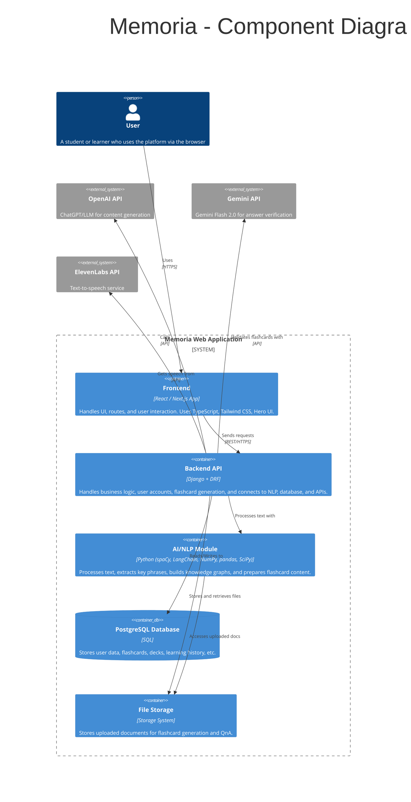

```mermaid
%%{init: { "theme": "default", "themeVariables": { "fontSize": "60px" } }}%%
%% C4 Model component diagram for Memoria

C4Context
title Memoria - Component Diagram

Person(user, "User", "A student or learner who uses the platform via the browser")

System_Boundary(c1, "Memoria Web Application") {

  Container(frontend, "Frontend", "React / Next.js App", "Handles UI, routes, and user interaction. Uses TypeScript, Tailwind CSS, Hero UI.")
  
  Container(backend, "Backend API", "Django + DRF", "Handles business logic, user accounts, flashcard generation, and connects to NLP, database, and APIs.")
  
  Container(ai_module, "AI/NLP Module", "Python (spaCy, LangChain, NumPy, pandas, SciPy)", "Processes text, extracts key phrases, builds knowledge graphs, and prepares flashcard content.")
  
  ContainerDb(database, "PostgreSQL Database", "SQL", "Stores user data, flashcards, decks, learning history, etc.")
  
  Container(file_storage, "File Storage", "Storage System", "Stores uploaded documents for flashcard generation and QnA.")
}

System_Ext(openai, "OpenAI API", "ChatGPT/LLM for content generation")
System_Ext(gemini, "Gemini API", "Gemini Flash 2.0 for answer verification")
System_Ext(elevenlabs, "ElevenLabs API", "Text-to-speech service")

Rel(user, frontend, "Uses", "HTTPS")
Rel(frontend, backend, "Sends requests", "REST/HTTPS")
Rel(backend, ai_module, "Processes text with")
Rel(backend, database, "Reads/Writes to")
Rel(backend, file_storage, "Stores and retrieves files")
Rel(ai_module, file_storage, "Accesses uploaded docs")
Rel(backend, openai, "Calls", "API")
Rel(backend, gemini, "Validates flashcards with", "API")
Rel(backend, elevenlabs, "Gets speech from", "API")
```